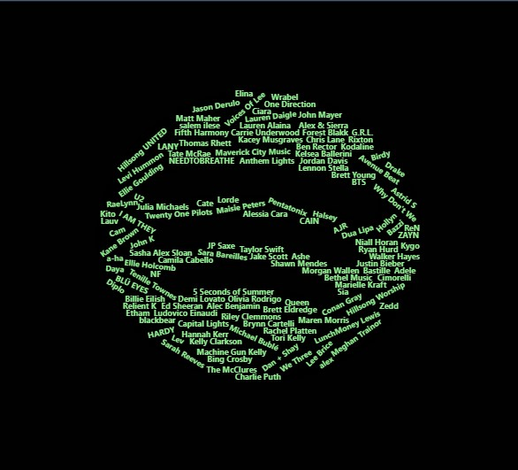
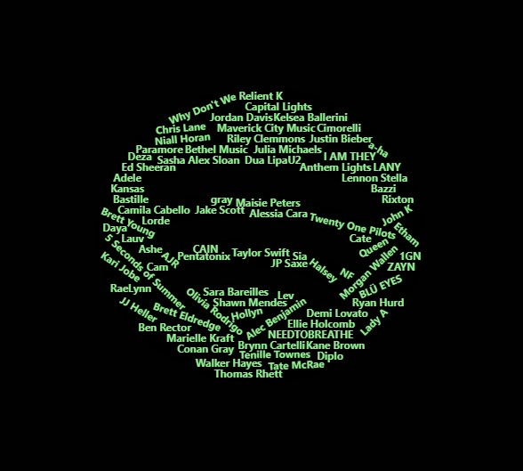

```{r include=FALSE}
library(jsonlite)
library(kableExtra)
library(dplyr)
library(ggplot2)
```


```{r include=FALSE}
x1 <- fromJSON("Data/StreamingHistory0.json")
x1 <- data.frame(x1)
x2 <- fromJSON("Data/StreamingHistory1.json")
x2 <- data.frame(x2)
x3 <- fromJSON("Data/StreamingHistory2.json")
x3 <- data.frame(x3)
streams <- rbind(x1,x2,x3)
library <- fromJSON("Data/YourLibrary.json", flatten=TRUE)
#View(library)
str(library)
lib.tracks <- data.frame(library$tracks)
lib.albums <- data.frame(library$albums)
lib.artists <- data.frame(library$artists)
playlist <- fromJSON("Data/Playlist1.json")
playlists <- playlist$playlists

```


## Day 1: December 22, 2021

The streams table will be the most helpful. Here is what it looks like.

```{r}
head(streams) %>% 
  kbl() %>% 
  kable_styling()
```

This chart shows the time at which the track was ended, the artist, the name of the track, and how long the track was played. The final column *msPlayed* stands for milliseconds played, so a conversion is necessary here in order to consider song lengths in seconds or minutes. 

```{r}
streams <- streams %>% 
  mutate(sec = msPlayed / 1000)
streams$endTime <- as.POSIXct(streams$endTime)
head(streams) %>% 
  kbl() %>% 
  kable_styling()
```

Taylor Swift was my top artist of 2021, so now I want to know which of her songs I listened to the most.

```{r fig.height=10}
tswizzle <- streams %>% 
  filter(format(endTime, "%Y") == 2021, artistName == "Taylor Swift", msPlayed > 10000) %>% 
  group_by(trackName) %>% 
  summarize(plays = n()) %>% 
  arrange(desc(plays))
tswizzle[1:20,] %>% 
  kbl() %>% 
  kable_styling()
ggplot(tswizzle[1:20,]) +
  geom_bar(aes(x=trackName, y=plays), stat="identity") +
  theme(axis.text.x = element_text(angle = 90, vjust = 0.5, hjust=1))
```

Preliminary graph above. Improvements to make: Highlight bars with different colors based on which album they are from, show number in the bar, adjust theme to remove grid lines, center title of graph, adjust axes titles, insert legend that explains colors, cite data in corner, add twitter in corner, remove everything in parentheses? (especially to combine counts of Taylor's Version songs with the original songs)

## Day 2: December 23, 2021

Time to make some improvements to the graph. First, the data needs to be updated to exclude songs that were skipped. I will consider songs played for less than 10 seconds to be songs that have been skipped. This corresponds to 10,000 milliseconds. This update was added retroactively to the previous code chunk since `tswizzle` is a summarized table.

Now the goal is to join the album name into the `tswizzle` table. Connecting to `lib.albums` should do the trick.

```{r}
tswizz_albums <- tswizzle %>%
  left_join(subset(lib.tracks, artist == "Taylor Swift"), by = c("trackName" = "track")) %>% 
  select(trackName, album, plays)
head(tswizz_albums) %>% 
  kbl() %>% 
  kable_styling()
```

The problem with this is that we have NA for some album titles. This theoretically should be solved when I get my extended streaming history. However, the problem here is that `lib.tracks` is a dataset containing only the tracks that I have saved in my library. Thus, those albums that I have not saved will not show up in the data. For example, I have saved evermore, but I did not save the deluxe edition so it is not identifying an album for right where you left me. Hopefully this problem will be fixed with the new wave of data. Otherwise, there will be some manual clean up to do.

```{r fig.height=10}
ggplot(tswizzle[1:20,]) +
  geom_bar(aes(x=trackName, y=plays, fill="light red"), stat="identity") +
  geom_text(aes(x=trackName, y=plays, label=plays), vjust="top") +
  theme(axis.text.x = element_text(angle = 90, vjust = 0.5, hjust = 1),panel.background = element_rect(fill="white"), axis.line=element_line(colour="black")) +
  labs(title = "Top 20 Taylor Swift Songs", x="Song", y="Number of Plays") +
  annotate("text", x=18, y = 68, label="Data: Spotify", color= "light gray") +
  annotate("text", x=18, y=65, label = "Viz: @KaraGodsey", color = "light gray") +
  guides(fill = FALSE)
```

## Day 3: December 31, 2021

Looking for a word art/cloud thing with the artist names. Potentially could do this with song titles as well.

There seem to be a few different ways to go about this, but I will mainly reference [this resource](https://towardsdatascience.com/create-a-word-cloud-with-r-bde3e7422e8a).

First things first, installing the necessary packages.

```{r}
#wordcloud packages
#install.packages("wordcloud")
library(wordcloud)
#install.packages("RColorBrewer")
library(RColorBrewer)
#install.packages("wordcloud2")
library(wordcloud2)

#text mining packages
#install.packages("tm")
library(tm)
```

There are two different word cloud packages. The older version will get the basic word cloud, but I believe the newer version of word cloud will allow me to make a cloud in the shape of the Spotify logo which could be cool. 

To do this with artist names, the names have to be smashed together otherwise it won't have the desired effect. For example, I want Taylor Swift to show up together rather than a giant Taylor and a little Swift in the background. It may not be as simple as smashing the first and last names together because some of the artist name values include (feat. "another artist"), but I think this problem will arise more with the song titles. 

```{r}
artists <- streams %>% 
  filter(msPlayed > 10000) %>% #filtering out skips
  select(artistName)
#gsub(" ","",artists$artistName) #removing spaces
```

The article recommends converting to a corpus, but because my data is already in tables, this is not necessary. Instead, I will just use `dplyr` functions to make a table of the frequencies that can be used to generate a word cloud.

```{r}
summary <- artists %>% 
  group_by(artistName) %>% 
  summarize(freq = n()) %>% 
  arrange(desc(freq))
```

And finally, the generation of the word cloud. Although there are just over 1,000 unique artists in this data set, the word cloud is restricted to the top 100 to avoid the additional time it takes to generate the Markdown file with so many data points.

```{r}
wordcloud(words=summary$artistName, freq=summary$freq, min.freq=1, max.words=100, random.order=FALSE, rot.per=0.35, colors=brewer.pal(20, "Dark2"))
```

## Day 4: January 2, 2022

Now the goal is to use the new word cloud package (`wordcloud2`) to make this word cloud appear in the shape of the Spotify logo. There is a general explanation of how this is possible in [this vignette](https://cran.r-project.org/web/packages/wordcloud2/vignettes/wordcloud.html#lettercloud-function). 

This is the word cloud function that will be used to make the custom shape; the example here simply uses the built-in circle shape to demonstrate.

```{r}
require(devtools)
install_github("lchiffon/wordcloud2")
#figPath = system.file("spotlogo1.png", package="wordcloud2")
wordcloud2(summary[1:50,], shape='circle', color = "lightgreen", backgroundColor = "black", size=.5)
```

Next, I attempted to get a word cloud with the custom shape as well as size of words corresponding to frequency. It didn't look great and the porportions were so different (Taylor Swift almost double the next highest) that it did not turn out well. Thus, the following code is not evaluated but here for reference later.

```{r eval=FALSE}
top <- artists %>% 
  group_by(artistName) %>% 
  summarize(freq = n()) %>% 
  arrange(desc(freq))
top200 <- top[1:200,]
top200$id <- seq(1:200)
plot(top200$id, top200$freq) #looks like we want to cut at like 20
top200[21:200, "freq"] <- 25
top200$freq <- (top200$freq)^(1/4)
logocloud <- wordcloud2(top200, size =.2, color="lightgreen", figPath = filepath, backgroundColor = "black", gridSize = 0.5)
logocloud
```

Thanks to my brilliant roommate, the resulting graphic is composed of all titles that are the same size. This ends up making it look more like the Spotify logo, and it also ensures that every artist that I want to appear is included in the cloud. In the code example I used top 250 artists. However, it is difficult to get the widget to load properly (have to refresh in the R viewer), so I just took a screenshot of the R viewer output and attached a jpeg of one of the iterations that looked most appealing.

```{r}
top <- artists %>% 
  group_by(artistName) %>% 
  summarize(freq = n()) %>% 
  arrange(desc(freq))
top250 <- top[1:250,]
top250$freq <- 1
filepath <- "~/R/Spotify/spotlogo1.png"
#samelogocloud <- wordcloud2(top250, size =.060, color="lightgreen", figPath = filepath, backgroundColor = "black", gridSize = 0.75)
#samelogocloud
```




